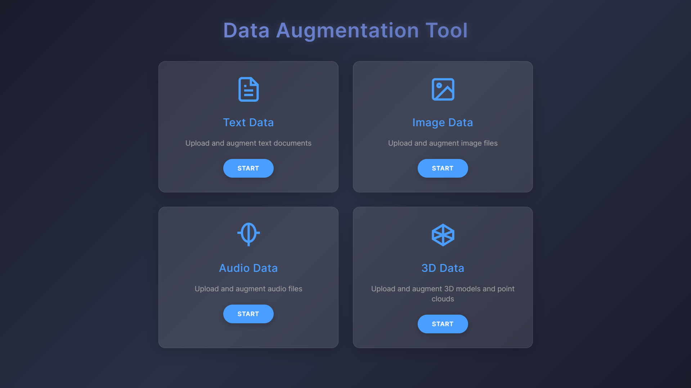

# Multi-Modal Data Augmentation Tool 🚀

> *"One tool to augment them all!"*


<p align="center">
  
</p>


## Overview
A comprehensive web application designed to preprocess and augment multiple data types: Text, Images, Audio, and 3D Models. Built with FastAPI and cutting-edge Python libraries, this tool is your Swiss Army knife for data augmentation!

## Features by Data Type

### 📝 Text Processing
#### Preprocessing Techniques
`Text Cleaning | Tokenization | Stop Word Removal | Lemmatization | Normalization`

#### Augmentation Techniques
`Synonym Replacement | Back Translation | Random Insertion | Random Swap | Random Deletion`

### 🖼️ Image Processing
#### Preprocessing Techniques
`Resizing | Normalization | Color Space Conversion | Noise Reduction | Edge Enhancement`

#### Augmentation Techniques
`Rotation | Scaling | Flipping | Translation | Brightness | Contrast | Saturation | Hue | Noise Injection | Random Erasing | Cutout`

### 🎵 Audio Processing
#### Preprocessing Techniques
`Resampling | Normalization | Noise Reduction | Silence Removal | Audio Trimming`

#### Augmentation Techniques
`Time Stretching | Time Shifting | Volume Adjustment | Pitch Shifting | Frequency Masking | Noise Injection | Room Simulation`

### 🎮 3D Model Processing
#### Preprocessing Techniques
`Mesh Decimation | Surface Smoothing | Hole Filling | Normal Recalculation | Texture Optimization`

#### Augmentation Techniques
`Rotation | Scaling | Translation | Noise Addition | Smoothing | Vertex Displacement`

## 🛠️ Technical Stack

### Core Python Libraries
```python
# Core Framework
fastapi, uvicorn, python-multipart

# Text Processing
nltk, transformers, textblob, spacy

# Image Processing
opencv-python, pillow, albumentations, scikit-image

# Audio Processing
librosa, soundfile, scipy, pyDynaMix

# 3D Processing
trimesh, numpy, open3d, pymeshlab

# Utilities
tqdm, pandas, matplotlib
```

### 🌟 Key Highlights

#### Python Libraries Used:
- **FastAPI**: Web framework for building APIs
- **NLTK & SpaCy**: Natural language processing and text manipulation
- **OpenCV & Pillow**: Comprehensive image processing capabilities
- **Librosa**: Advanced audio processing and feature extraction
- **Trimesh & Open3D**: Robust 3D model manipulation and visualization

> *"From text to 3D, we've got your augmentation needs covered!"*

## Usage
1. Select data type (Text/Image/Audio/3D)
2. Upload your data
3. Choose preprocessing options
4. Apply augmentations

###### "Don’t curse me after seeing main.py!"

